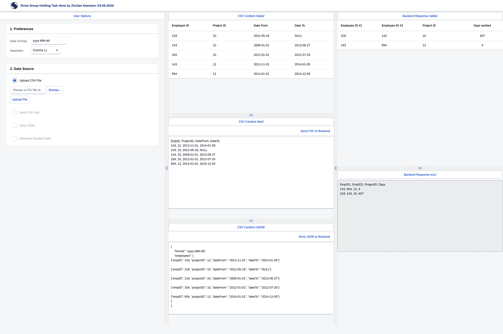

## Getting started


   
1. Clone this repository and navigate into it
    ```sh
    git clone https://github.com/zhulianatanasov/Zhulian-Atanasov-employees-fe-.git
    cd Zhulian-Atanasov-employees-fe-
    ```
1. Install UI5 CLI
    ```sh
    # Global
    npm install --global @ui5/cli
    
    # In your project
    npm install --save-dev @ui5/cli
    ```
   
1. Install all dependencies
    ```sh
    npm install
    ```

1. Start a local server and run the application (http://localhost:8080/index.html)
    ```sh
    ui5 serve -o index.html
    ```